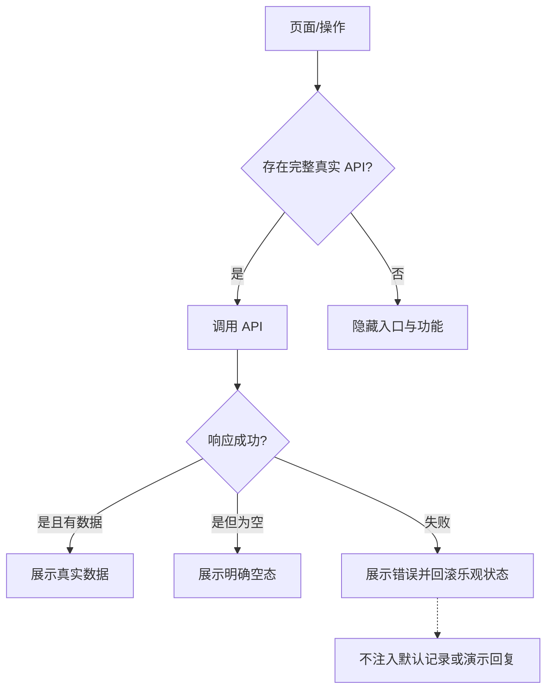

# 全站移除模拟数据实施方案

- 功能名称：全站-移除模拟数据
- 日期：20260902
- 版本：v2（方案评审及三轮代码 Review 均已通过）
- 任务级别：大型任务（跨前端、后端、测试、运行数据与文档，10 步以上）

## 1. 用户原始需求

> 现在去除当前系统所有页面的mock模拟数据 如果有真实API接口调用真实API接口 没有的则先不展示

## 2. 目标与验收口径

### 2.1 目标

1. 页面运行时只展示真实 API 返回的业务数据，不再以内置数组、本地临时记录或固定回复冒充服务端数据。
2. 已有真实 API 的页面及操作继续使用真实接口，并补齐失败、空数据和加载状态。
3. 没有后端 API 或调用链未真正闭环的页面入口、按钮和说明暂时隐藏。
4. 后端没有可用真实模型渠道时明确返回服务不可用，不再生成 `local-demo` 回复或持久化模拟消息。
5. 测试继续允许使用隔离的测试替身，但测试数据库必须与开发数据库强制隔离，避免测试记录再次出现在真实 API 页面。
6. 对开发数据库历史记录先生成候选与关系闭包报告；只使用经确认的主键 manifest，并在校验数据库/资产备份和目标指纹后事务清理。后续清理强制使用 Manifest v2，将完整审计状态摘要、精确主键闭包与备份 SHA-256 绑定，并在事务内重新校验。清理后必须输出三分类 post-audit，并保留明确的真实账户。

### 2.2 “Mock”边界

本次删除：

- 生产源码中的默认会话、固定用户/回复、`local-*` 会话、本地流式回复和 API 失败回退数据。
- 生产页面中只改变本地状态或只弹 Toast、却宣称功能已经完成的入口。
- 登录与渠道表单中作为真实 value 预填的演示账号、密码和地址。
- 用户详情请求失败后伪造的零值统计。
- 后端无渠道时的 `local-demo` 业务回复。
- 公共首页中带具体项目、对话与回复内容的虚构工作区记录。

本次保留：

- 单元/接口测试目录中的测试替身、`FakeResponse`、fetch mock 和隔离数据库 fixture。
- 输入框 placeholder、空状态文案、加载骨架、图片生成等待卡等明确的 UI 状态。
- `新聊天`、默认图片质量/尺寸等业务或协议默认值。
- 系统启动所需的配置化初始管理员及显式环境变量渠道种子；它们不是页面失败回退。
- 基于真实 API 当前结果在浏览器生成的使用记录 CSV。
- 首页对真实已实现能力的静态产品说明；不展示虚构项目、会话、消息和统计记录。

## 3. 实施前审计与最终结果

### 3.1 前端运行时模拟数据

- `src/App.tsx`
  - `recentTitles`、`defaultThreads` 内置会话和问候内容。
  - `replyText`、`startLocalStream()` 以及网络失败后切换演示回复。
  - 创建失败、删除最后一条会话后生成 `local-*` 会话。
  - 本地会话的发送、重新生成、删除、导出等特殊分支。
  - 账户名 `Dream` 回退。
- `src/Root.tsx`
  - 登录页预填管理员邮箱和密码。
  - 注册显示名为空时传固定 `User`。
- `src/components/AdminUsersPage.tsx`
  - 用户详情失败时用 0 项目、0 会话、0 请求打开详情。
- `src/components/AdminModelChannelsPage.tsx`
  - 新渠道 Base URL 使用示例地址作为实际初值。
- `src/components/LandingPage.tsx`
  - 工作区预览包含虚构项目、会话、用户请求及模型回复。

### 3.2 无真实能力的可见交互

- 侧栏图片库、资料库、已安排、插件、Codex 独立页。
- 公共分享、回复分享、赞/踩反馈。
- 语音输入与语音模式。
- 帮助、用户设置、管理端设置。
- 通用工作区“新建/开始使用”Toast。
- 非图片文件上传后的“后续对话中使用”声明；当前文本请求未消费这些资产。

保留的真实能力：项目、已归档对话、搜索、重命名、归档/恢复、删除、导出、复制、停止、重新生成、文本流、图片生成/编辑、参考图上传、模型选择、授权状态、三个管理页面。

### 3.3 后端模拟路径

- `backend/app/services/providers.py::local_text()` 返回固定演示文本。
- `backend/app/api/workspace.py::_stream_message()` 在渠道为空时调用本地回复。
- `send_message_stream()` 与 `regenerate_message()` 在无模型时隐式选择 `local-demo`。
- 当前消息接口会在流式生成器开始后才解析渠道，需保证无渠道错误发生在创建/修改消息之前，避免失败请求留下业务记录。

### 3.4 实施前测试数据隔离问题

- `backend/tests/conftest.py` 使用 `os.environ.setdefault()` 设置 SQLite 测试库；外部存在 `CHAT_DATABASE_URL` 时会继续连接开发 MySQL。
- 当前开发库出现大量与 `backend/tests/test_api.py` 一致的测试用户、项目、会话、请求及审计记录。
- 清理策略定为：备份 -> 只读分类报告 -> 确认主键 manifest -> 单事务删除 -> post-audit 三分类与运行 API 复核。

### 3.5 最终审计与清理结果

- 已补齐消息/请求/资产/导出的完整 `local-*` marker 扫描、测试用户所有权的 10 表关系闭包，以及 `deleted / retained / needs_manual_migration` 三分类。
- 基于用户的全站去 Mock 请求生成 348 个确定用户主键的批准 manifest，在数据库和资产备份完成后事务清理。
- 删除 1,952 条：users 348、refresh tokens 349、entitlements 189、projects 104、threads 233、messages 274、model requests 197、exports 69、audit logs 189。
- post-audit 中所有测试候选、`local-demo/local-*` 候选、保留分类和待迁移分类均为 0；真实账户 `admin@example.com` 与 `owner@example.net` 保留。

## 4. 技术方案设计

### 4.1 数据来源原则

- 加载失败与空数据必须区分；两者都不展示内置业务记录。
- 创建、删除、归档、恢复、重命名等操作以 API 成功为准；乐观更新失败时回滚或重新加载。
- 不再创建本地业务 ID。客户端仅可使用短期 `pending-*` ID 表示正在提交的 UI 状态，并在失败时移除，不能成为可继续操作的会话。
- 未加载到模型时隐藏模型下拉选项并禁止发起对应类型请求，给出真实配置提示。

#### 资源—状态—UI 行为矩阵

各资源独立加载和重试，不使用一个 `Promise.all` 失败掩盖其他成功结果。

| 资源 | 加载中 | 成功且有数据 | 成功但为空 | 请求失败 |
|---|---|---|---|---|
| 活跃会话 `/threads` | 主区域显示“正在加载对话”且禁用会话操作 | 展示真实会话并激活首条 | 展示“还没有对话”和真实“新聊天”入口 | 展示“对话加载失败/重试”，不创建或展示默认会话 |
| 归档会话 `/threads?include_archived=true` | 归档页显示加载态 | 展示真实归档列表 | 展示“暂无已归档对话” | 展示“归档加载失败/重试”，不当作空列表 |
| 项目 `/projects` | 项目页显示加载态 | 展示真实项目 | 展示项目空态和真实创建入口 | 展示“项目加载失败/重试”，不影响会话数据 |
| 模型 `/models` | 模型选择与发送暂时禁用 | 按文本/图片能力展示 | 显示“未配置可用模型”，禁用对应模式发送 | 显示“模型加载失败/重试”，与“无模型”区分 |
| 权限 `/me/entitlement` | 普通用户发送暂时禁用 | 以真实 `active` 控制请求 | 显示“未开通权限” | 显示“权限状态加载失败/重试”，不默认判定有权限 |

#### 写操作一致性矩阵

| 操作 | UI 更新时机 | 失败行为 |
|---|---|---|
| 创建会话/项目 | API 成功后插入 | 保持原列表并提示失败 |
| 重命名 | API 成功后更新标题 | 保留旧标题 |
| 删除/归档 | API 成功后移出活跃列表 | 保持原会话及选中状态 |
| 恢复归档 | API 成功后移动到活跃列表 | 保持归档列表不变 |
| 发送/图片生成 | 可显示 `pending-*` 临时消息 | 失败移除临时消息；临时 ID 不参与后续业务操作 |
| 重新生成 | 临时清空当前回复并保留快照 | 失败恢复完整旧回复 |

### 4.2 聊天工作区

1. `threads=[]`、`activeId=''` 初始化；首次加载真实 `/threads`、归档与项目。
2. 没有会话时保留真实空态，不自动用本地数据填充。用户点击“新聊天”后才 POST `/threads`。
3. 创建失败不插入会话；成功后再激活返回的服务端 ID。
4. 发送消息仅允许存在服务端会话 ID；请求失败移除对应乐观消息或恢复重新生成前内容。
5. 删除/归档最后一个会话后 `activeId=''`，显示空态，不制造本地会话。
6. 删除本地流、`local-*` 判断、演示导出提示和离线 fallback。
7. 参考图上传保留；仅接收图片。文本请求将当前参考图 ID 传入 `asset_ids`，使文本模型触发图片工具时也能真实编辑参考图。
8. 隐藏无 API 导航、分享、反馈、语音、帮助、设置和非图片文件上传。
9. “更多”改为明确的“已归档”，只显示真实归档 API 数据和恢复操作。
10. 账户区仅在真实用户信息存在时显示真实名称，不使用具体假人名。

### 4.3 认证、首页与管理端

- 登录邮箱、密码初值为空；注册显示名称改为必填，与请求 schema 一致，不传固定假名称。
- 首页移除虚构工作区记录及对应“工作区”锚点入口；保留与现有 API 能力一致的静态说明。
- 用户详情加载失败时不打开详情，不展示 0 统计；通过现有通知显示错误。
- 新渠道 Base URL 初值为空，示例仅作为 placeholder。
- 管理端设置按钮隐藏。
- 只渲染三个明确的管理路由；未知 `/admin/*` 不再误落到使用记录页。

### 4.4 后端无渠道处理

1. 删除 `local_text()` 及其导入与分支。
2. 抽取 `resolve_text_channel(db, requested_model, thread_model, channel_id)`，统一解析请求模型、线程模型、指定渠道和默认真实渠道，并验证启用状态与文本能力。
3. 模型未指定时只从启用且具备文本能力的真实渠道选择；为空立即抛出 503。
4. 指定 `channel_id` 不存在、已停用或与模型/能力不匹配时返回 422；模型没有任何启用渠道时返回 503。
5. 发送与重新生成在计算 sequence、创建占位消息、清空回复、修改线程或创建 ModelRequest 前完成渠道解析和资格检查。
6. 发送无渠道返回后，`Message`、`ModelRequest` 数量和 `Thread.model/updated_at` 必须不变；重新生成无渠道返回后，目标回复、后续消息、请求记录及线程字段必须不变。
7. 原子性保证范围为本地数据库预检。预检后渠道被并发停用或上游 Provider 中断时，沿用现有 SSE 错误/停止协议和回复恢复逻辑。
8. 保持 SSE 成功事件、幂等重放、停止和工具生图协议不变。

### 4.5 测试数据库与现有数据

1. `backend/tests/conftest.py` 在导入 `app.db.session`、`app.main` 等任何应用模块前，无条件设置本次测试专用 `CHAT_DATABASE_URL`、`CHAT_STORAGE_DIR`、`CHAT_JWT_SECRET`、`CHAT_ENCRYPTION_KEY`，清空 `CHAT_MODEL_CHANNELS_JSON`，并提高测试限流。
2. 清理 `get_settings()` 缓存；应用启动后断言 `get_settings().database_url` 与 `engine.url` 都是本次临时目录中的 SQLite，资产目录也位于该目录，否则立即终止测试。每个并行 worker 使用独立临时根目录、SQLite 和资产目录。
3. 将依赖 `local-demo` 的 SSE/重新生成/幂等测试改为创建临时真实渠道记录并 monkeypatch Provider 返回确定的测试结果；function-scope autouse fixture 在每个用例前重建表和资产目录。
4. 增加无渠道 503 且不落消息/不修改旧回复的回归测试。
5. 提供审计/清理脚本，默认只读输出测试用户、全量 `local-*` marker、10 表所有权关系闭包、引用更新、各表影响计数和三分类。
6. `--apply` 不接受邮箱前缀、域名、显示名等宽泛条件，必须同时提供 Manifest v2、目标数据库指纹、结构完整且 SHA-256 匹配的数据库 SQL dump 与安全 tar.gz 资产备份；SQLite dump 会实际恢复并核对表计数/主键，MySQL dump 会核对目标、表结构、完成标记和批准主键。
7. Manifest v2 保存根主键、全量 `approved_primary_keys` 闭包和全库逐表逐行 `audit_state` 摘要。apply 在单事务中锁定清理表、重算状态与闭包并要求完全相等，只删除或更新已批准主键；任意审计后新增/修改关系都会中止。
8. 清理后再次审计 `local-demo` 会话/请求/演示消息与所有持久化 `local-*` 标记，输出 `deleted / retained / needs_manual_migration` 三分类；本次确认清理后候选、保留和待迁移均为 0。
9. 增加独立隔离验证：在受控 pytest 子进程前后读取一次开发库指纹与各业务表计数，断言连接信息和计数完全一致；同时记录测试子进程实际 engine URL，证明其只访问临时 SQLite。该验证只读访问开发库，不将开发 URL 注入测试进程。

## 5. API 对照

| 页面/能力 | 真实接口 | 处理 |
|---|---|---|
| 登录/注册/会话恢复 | `/auth/login`、`/auth/register`、`/auth/me`、`/auth/refresh`、`/auth/logout` | 保留，去预填值 |
| 项目 | `/projects` | 保留 |
| 会话与归档 | `/threads`、`/threads/{id}` | 保留，去本地会话 |
| 文本流/停止/重新生成 | `/threads/{id}/messages/stream`、`messages/stop`、`regenerate` | 保留，去本地流 |
| 图片生成/编辑 | `/threads/{id}/image-generations`、`/assets/upload`、资产读取 | 保留，仅展示图片附件 |
| 模型列表 | `/models` | 保留，空列表不伪造 |
| 导出 | `/threads/{id}/export` | 保留 |
| 渠道管理 | `/admin/model-channels` 及 test/sync | 保留 |
| 用户管理 | `/admin/users`、状态、授权 | 保留，去失败零值 |
| 使用记录 | `/admin/usage` | 保留 |
| 分享/反馈/语音/设置/资料库/日程/插件/Codex/图片库 | 无完整 API | 隐藏 |

## 6. 影响范围与文件清单

| 文件 | 预计变更 |
|---|---|
| `src/App.tsx` | 移除默认数据、本地流、本地会话与无 API 入口；重构空态和失败回滚 |
| `src/Root.tsx` | 清空登录值、注册名必填、隐藏设置、明确管理路由 |
| `src/components/LandingPage.tsx` | 移除虚构工作区记录和无效锚点 |
| `src/components/AdminUsersPage.tsx` | 删除详情零值 fallback |
| `src/components/AdminModelChannelsPage.tsx` | 清空新增渠道地址初值 |
| `src/App.test.tsx` | 覆盖空列表、接口失败、无伪数据及保留真实聊天链路 |
| 新增/现有前端测试 | 覆盖认证、用户详情和无 API 入口 |
| `backend/app/api/workspace.py` | 移除 `local-demo`，将渠道校验前置 |
| `backend/app/services/providers.py` | 删除 `local_text()` |
| `backend/tests/conftest.py` | 强制测试库和资产隔离 |
| `backend/tests/test_api.py` | 替换 `local-demo` 依赖，新增无渠道原子性测试 |
| `backend/tests/test_cleanup_test_fixtures.py`（新增） | 56 项清理工具回归：闭包、Manifest v2、备份结构/SHA/目标、状态漂移、事务删除/回滚与 post-audit |
| `backend/tests/test_verify_test_isolation.py`（新增） | 9 项验证器回归：记录聚合、重复/缺失 worker、参数解析与资源唯一性 |
| `backend/scripts/cleanup_test_fixtures.py`（新增） | 全量 marker 与 10 表闭包审计；Manifest v2 绑定审计状态、精确闭包及可恢复备份后事务清理 |
| `backend/scripts/verify_test_isolation.py`（新增或等价验证命令） | 比较 pytest 前后开发库指纹/表计数，聚合并验证 main/gwN 独立 engine/storage 记录 |
| `backend/pyproject.toml` | 声明 pytest 与 pytest-xdist 开发依赖，保证并行验证可复现 |
| `docs/聊天系统.md` | 更新数据源、无渠道与暂不展示能力说明 |
| `dist/` | 前端构建后刷新静态产物 |
| `md/impl-全站-移除模拟数据-20260902.md` | 实施记录 |
| `md/review-全站-移除模拟数据-20260902.md` | 最终代码审查 |

## 7. 文件/类/方法级 To-Do

### 7.1 前端

- [x] `src/App.tsx`
  - [x] 删除 `recentTitles`、`defaultThreads`、`replyText`、`restrictedWorkspaceViews`、`startLocalStream()`。
  - [x] 缩减 `WorkspaceView`、`navItems` 与无用图标，只保留项目和已归档。
  - [x] `ChatWorkspace` 状态改为真实空初值，增加数据加载/加载失败状态。
  - [x] 修改初次 `load()`，并行接口各自处理成功/失败，不保留旧 fixture，不自动创建演示会话。
  - [x] 修改 `activeThread`、`createThread()`、`send()`、`regenerate()`、`removeActiveThread()`、`restoreThread()`、`renameThread()`，清除本地 ID 路径并按 API 成功更新。
  - [x] 修改 `startRemoteStream()` 异常分支，只回滚/展示错误，不启动本地流。
  - [x] 修改 `uploadAttachment()` 与文件 input，仅接受图片；文本发送传真实 `referenceAssets` ID。
  - [x] 删除 `shareOpen`、`copyShareLink()`、语音/反馈/设置相关状态和 JSX。
  - [x] 将通用 `WorkspacePage` 收敛为真实 `ArchivedThreadsPage`。
  - [x] 精简 `MessageView` 为复制与真实重新生成操作。
  - [x] 对无会话、无模型、加载失败添加可验证 UI 状态与禁用条件。
  - [x] 移除固定头像资源，账户区使用真实显示名首字符。
  - [x] 文本/图片模型能力独立解析，图片会话切回文本或重生成时不提交图片模型。
  - [x] 停止操作等待真实 API 的 `stopped=true`，失败时保留流状态且不提示假成功。
  - [x] Clipboard 写入成功后才显示复制完成状态。
- [x] `src/Root.tsx`
  - [x] `AuthPage` 输入初值为空，注册显示名必填并原样发送。
  - [x] 删除管理端设置按钮与无效 notice 依赖。
  - [x] `AdminShell` 仅匹配三个显式路径；未知管理路径跳转到渠道页或返回明确空路由。
- [x] `src/components/LandingPage.tsx`
  - [x] 删除带虚构项目/会话/消息内容的 `landing-preview`。
  - [x] 删除指向该预览的“工作区”导航锚点；核对剩余文案与真实能力一致。
- [x] `src/components/AdminUsersPage.tsx`
  - [x] 失败时不创建详情对象；清理旧详情并通知错误。
  - [x] 用户列表区分加载、真实空数据与失败重试，失败时不展示零统计。
- [x] `src/components/AdminUsagePage.tsx`
  - [x] 使用记录区分加载、真实空数据与失败重试，失败时隐藏统计并禁用导出。
- [x] `src/components/AdminModelChannelsPage.tsx::emptyDraft`
  - [x] `base_url` 改为空字符串，保留输入提示。

### 7.2 后端

- [x] `backend/app/services/providers.py`
  - [x] 删除 `local_text()` 与不再使用的类型导入。
- [x] `backend/app/api/workspace.py`
  - [x] 删除 `local_text` 导入与 `_stream_message()` 本地分支。
  - [x] 抽取/复用真实文本渠道解析函数。
  - [x] `send_message_stream()` 在持久化用户/助手消息之前验证模型和渠道。
  - [x] `regenerate_message()` 在删除后续消息、清空内容之前验证模型和渠道。
  - [x] 保持指定渠道不匹配为 422、无可用模型渠道为 503，并保证事务原子性。
- [x] `backend/tests/conftest.py`
  - [x] 在应用导入之前强制覆盖测试数据库、资产目录、JWT/加密密钥和渠道种子配置。
  - [x] 清理设置缓存并断言 settings、engine 和资产目录均指向当前临时根目录。
  - [x] 将测试实际 engine URL 写入临时验证记录，供隔离回归脚本核验。
  - [x] 使用 function-scope autouse fixture 在每个用例前重建表/资产目录，并按 worker ID 隔离并行临时根目录。
- [x] `backend/tests/test_api.py`
  - [x] 新增可复用的临时真实渠道 fixture/provider stub。
  - [x] 替换 SSE replay/export/regenerate/idempotency 中的 `local-demo`。
  - [x] 新增发送无渠道 503 不落库测试。
  - [x] 新增重新生成无渠道 503 不改原消息测试。
- [x] `backend/scripts/cleanup_test_fixtures.py`
  - [x] 实现候选报告、`local-demo` 与持久化 `local-*` 审计、关联闭包、前后计数和无法确定项报告。
  - [x] `--apply` 强制 Manifest v2、备份 SHA/结构/目标校验、逐行审计摘要和精确闭包，并在单事务锁定后重算一致才执行。
  - [x] 扩展完整 local marker、10 表用户所有权闭包、引用更新和 post-audit 三分类。
- [x] `backend/tests/test_cleanup_test_fixtures.py`
  - [x] 增加 56 项清理工具用例，覆盖 dry-run、Manifest v2、备份结构/SHA/目标、状态漂移、闭包、单事务删除/回滚及 post-audit。
- [x] `backend/scripts/verify_test_isolation.py` 或等价自动化验证
  - [x] 在 pytest 前后只读采集开发库 URL 指纹和业务表计数并断言一致。
  - [x] 启动 pytest 子进程时显式移除开发 URL，聚合 main/gwN 独立记录，核验 worker 集合与每个 engine/storage 均唯一且位于临时目录。

### 7.3 验证、文档与构建

- [x] 增补前端失败/空态测试，保留正常文本流、图片生成与停止测试。
- [x] 运行 `npm test`：23 passed；运行 `npm run build`，生产 JS 为 `dist/assets/index-CxP3MhrZ.js`。
- [x] 运行后端完整 `pytest`：120 passed（含清理工具 56 项、隔离验证器 9 项）；`-n 2` 隔离脚本记录 main/gw0/gw1 三套独立 SQLite/资产目录，开发库连接指纹与各表计数前后不变。
- [x] 启动前后端；运行 API 检查均为 HTTP 200，当前用户总数 2、可用模型 7、渠道 1；浏览器与组件测试覆盖关键页面状态。
- [x] 执行 dry-run，基于用户请求生成 348 主键 manifest，完成数据库/资产备份后事务清理 1,952 条；post-audit 候选、保留和待迁移均为 0。
- [x] 使用 `rg` 确认生产源码和新构建产物不存在默认会话、本地演示、`local-demo`、演示凭据与假人名。
- [x] 创建 Impl 文档。
- [x] 完成第一轮 Codex 代码审查，修复历史数据、审计闭包、用例级隔离和清理工具测试问题。
- [x] 完成第二轮 Codex 代码审查，并修复备份门禁、Manifest TOCTOU、注册固定名称和 worker 证据链问题。
- [x] 完成第三轮 Codex 代码审查；P0、P1、P2、P3 均无问题，最终审查通过。
- [x] 更新 `docs/聊天系统.md`。

## 8. 实施步骤概要

1. 完成全站页面、API、后端 fallback 与运行数据审计。
2. 创建 Plan v1。
3. 执行 Plan 可行性评估并生成 `plan-review`。
4. 根据评估修订 Plan v2，确认文件/方法级 To-Do。
5. 先修复测试数据库隔离，验证测试不会再连接开发 MySQL。
6. 移除后端 `local-demo`，调整渠道校验顺序和测试。
7. 重构聊天工作区真实数据、空态、错误回滚。
8. 清理认证、首页、用户详情、渠道表单及管理端伪入口。
9. 增补前后端测试并运行完整回归。
10. 重建 `dist`，进行浏览器关键流程联调。
11. 生成开发库历史测试与全量 `local-*` 报告；在完成 348 主键 manifest、数据库/资产备份与指纹复核后事务清理，并以 post-audit 验证三分类全部归零。
12. 创建 Impl、执行代码 Review、完成迭代与文档归档。

## 9. 风险与控制

| 风险 | 控制措施 |
|---|---|
| 删除最后会话后组件访问空对象 | 所有操作使用 `activeThread?: Thread`，空态禁用会话级按钮 |
| 乐观消息在请求失败后残留 | 记录 pending ID，失败统一回滚；成功用服务端 ID 替换 |
| 无渠道检查过晚造成脏消息 | 渠道解析前置到事务写入之前，并增加消息数不变测试 |
| 重新生成失败破坏旧回复 | 校验渠道在清空/删除之前；异常恢复旧内容并测试 |
| 隐藏入口时误删真实图片编辑能力 | 保留输入框图片模式、参考图上传、生成和工具调用，只隐藏图片库 |
| 测试再次污染开发数据库 | 在任何应用导入前无条件覆盖测试 URL，并以运行时断言验证 SQLite 临时路径 |
| 清理脚本误删真实数据 | 默认只报告；apply 强制 Manifest v2、审计状态/完整闭包/备份 SHA 与结构校验，并在锁定事务内重算一致后精确执行 |
| 首页布局因移除预览失衡 | 同步调整 Hero 布局和响应式 CSS，浏览器截图核验 |
| 旧构建仍携带 Mock | `npm run build` 后扫描 `dist` 并检查新资源 hash |
| 当前渠道短时不可用 | 页面显示真实错误，不使用模拟数据掩盖故障 |

## 10. 回滚方案

1. 代码：保留变更前文件副本或使用补丁逆向恢复；项目无 Git 元数据时，在实施前生成受影响文件归档。
2. 数据库：清理前生成完整备份；清理脚本在单事务中执行，异常自动回滚；仅在验证后提交。
3. 构建：保留现有 `dist` 归档，构建验证失败时恢复旧静态产物但不发布。
4. 服务：后端变更不涉及 schema 迁移；回滚时恢复 Provider/Workspace 文件并重启服务。

## 11. 验收清单

- [x] API 返回空会话时，页面不出现任何内置标题或问候回复。
- [x] API 失败时不出现 `local-*` 会话或演示回复。
- [x] 无文本渠道时发送和重新生成返回 503，数据库消息与旧回复不变。
- [x] 无 API 的页面、菜单、分享、反馈、语音、设置和文件功能在 DOM 中不存在。
- [x] 项目、归档、复制、导出、文本流、停止、重新生成、图片生成/编辑继续调用真实 API。
- [x] 登录页无预填凭据，渠道新增表单无预填地址，用户详情失败不显示假 0。
- [x] 首页不展示虚构项目、会话和消息。
- [x] 测试连接隔离数据库；自动验证记录证明测试前后开发库连接指纹和各业务表计数不变。
- [x] 开发库清理具备 348 主键批准 manifest、数据库/资产备份、指纹、事务执行统计和 post-audit；删除 1,952 条后所有候选与待迁移均为 0，保留两个真实账户。
- [x] 前端测试、后端测试、生产构建和浏览器关键路径均通过。
- [x] `src`、`backend/app`、`dist` 不再包含生产演示数据与 `local-demo` 路径。
